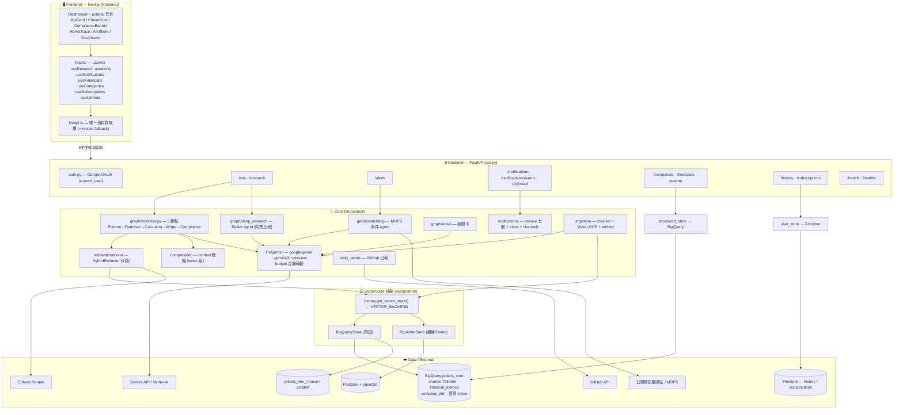
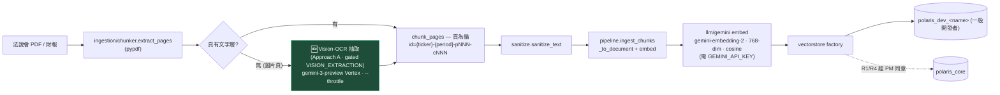
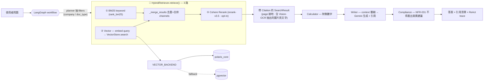
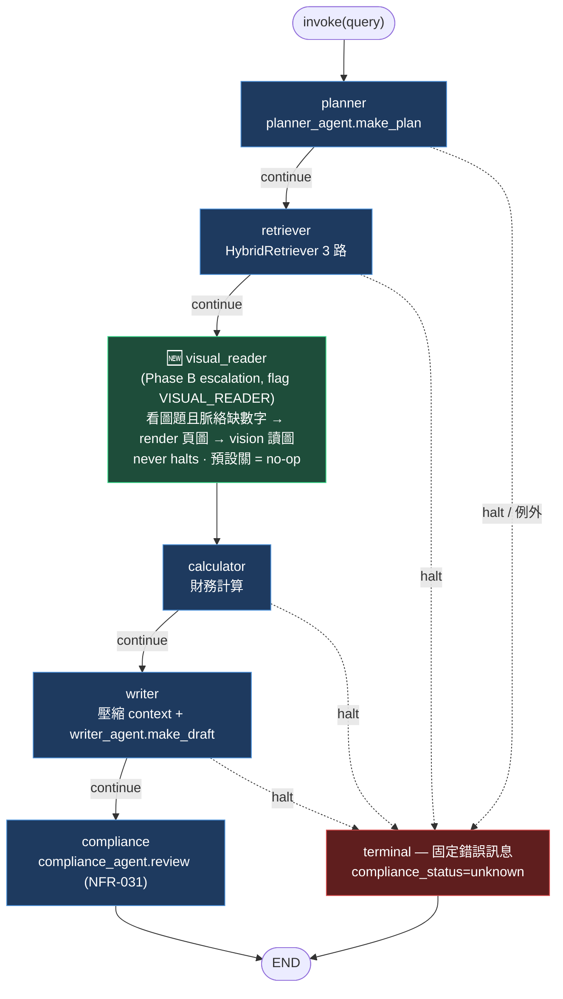
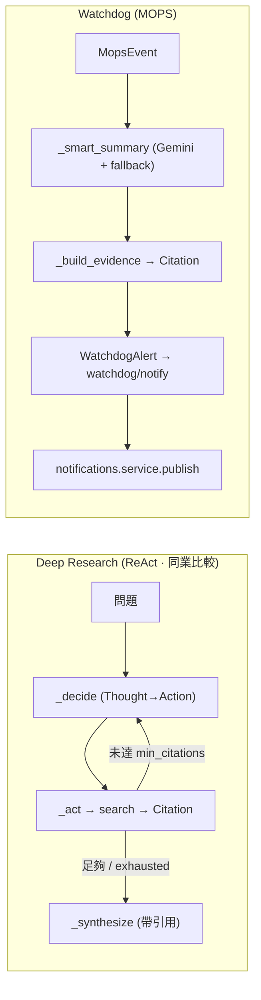
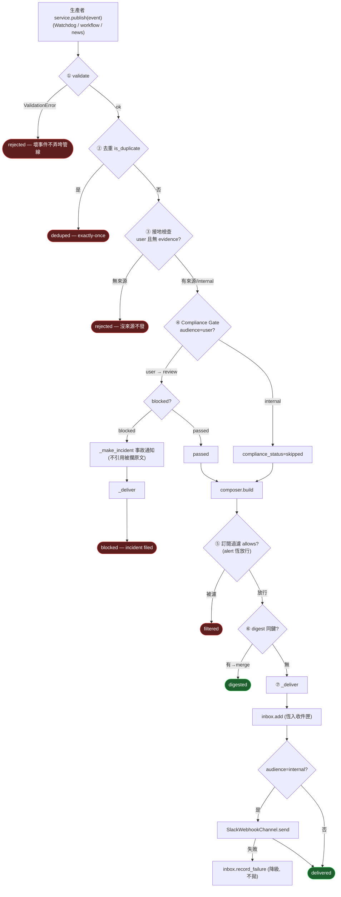
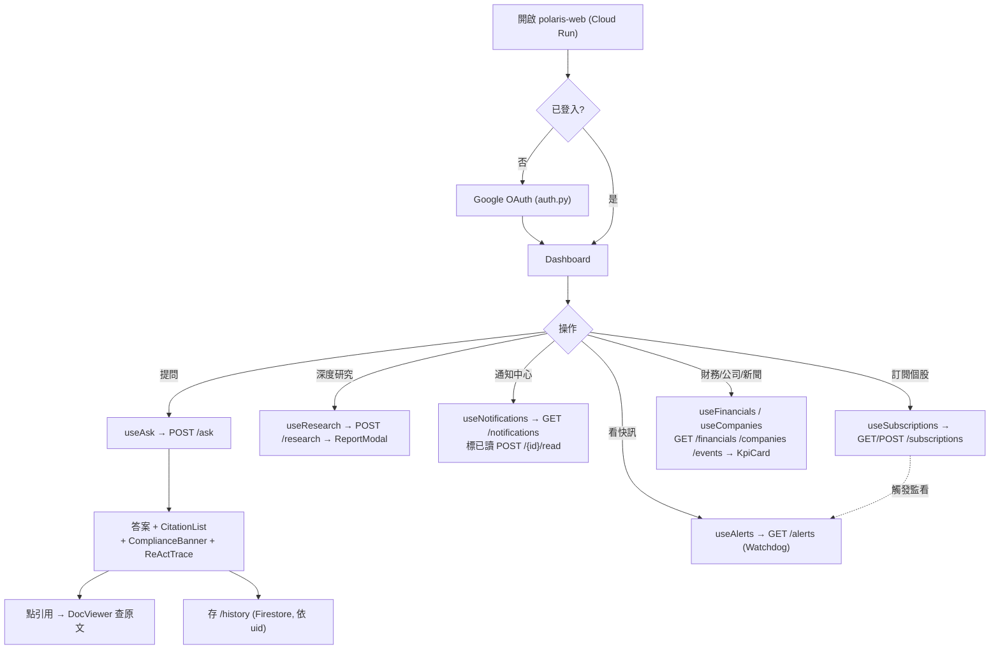

# Polaris Desk — 軟體架構 / 資料流程 / 使用者流程

> 本文件依 `src/polaris/` 與 `frontend/src/` 實際程式碼（import 圖、API 路由、前端 hooks）整理。
> **視覺處理：ColPali 退役為兩段** ——
> ① **入庫期**：Vision-OCR 抽圖表文字進索引（`ingestion/vision_*`, gated `VISION_EXTRACTION`）。
> ② **查詢期**：`graph/nodes/visual_reader.py` Phase B escalation（gated `VISUAL_READER`，預設關）。
> eval 場景 3 已改走文字 workflow（`_run_visual` 已移除）；`colpali_*` 模組軟退役（保留檔案，
> 因 R4 #133 query encoder 剛建出，硬刪需與 R4/PM 對齊）。

---

## 0. 模組依賴分層（verified import graph）

```mermaid
flowchart TB
    subgraph L0["基礎層"]
        CFG["config.py"]
        RETRY["retry.py"]
    end

    subgraph L1["LLM / 向量 / 壓縮"]
        BUD["llm/budget.py"]
        GEM["llm/gemini.py"]
        TOK["compression/tokens.py"]
        COMPR["compression/compressors.py"]
        VBASE["vectorstore/base.py"]
        VFAC["vectorstore/factory.py"]
        VBQ["bigquery_store"]
        VPG["pgvector_store"]
        VCP["colpali_store (legacy)"]
    end

    subgraph L2["graph 核心型別 / 提示 / 工具"]
        STATE["graph/state.py — ResearchState (中樞型別)"]
        PROMPTS["graph/prompts.py"]
        COMPLI["graph/compliance.py"]
        REDACT["graph/redaction.py"]
        TEMPORAL["graph/temporal.py"]
    end

    subgraph L3["節點 / 檢索"]
        TRACE["nodes/trace.py"]
        PLAN["nodes/planner_agent.py"]
        WRITE["nodes/writer_agent.py"]
        CAGENT["nodes/compliance_agent.py"]
        STUBS["nodes/stubs.py (wiring 真 agent)"]
        RETR["retrieval/retriever.py — HybridRetriever"]
    end

    subgraph L4["編排 / 專用 agent"]
        WF["graph/workflow.py — 5 節點"]
        DR["graph/deep_research/* — ReAct"]
        WD["graph/watchdog/* — MOPS"]
        NEWS["graph/news/* — 新聞卡"]
    end

    subgraph L5["服務 / 入庫 / 評測 / 日報"]
        NOTIF["notifications/* — service 七關"]
        INGEST["ingestion/* — chunker+pipeline"]
        EVAL["eval/* — Ragas 管線"]
        DAILY["daily_status/* — GitHub 日報"]
    end

    subgraph L6["對外 / 儲存"]
        API["api.py — FastAPI"]
        AUTH["auth.py — Google OAuth"]
        SSTORE["structured_store.py → BigQuery"]
        USTORE["user_store.py → Firestore"]
        SERVER["server.py"]
    end

    RETRY --> GEM
    CFG --> BUD --> GEM
    TOK --> GEM
    VBASE --> VFAC
    VFAC --> VBQ & VPG & VCP
    STATE --> TEMPORAL & RETR & NOTIF
    PROMPTS --> PLAN & WRITE & CAGENT
    GEM --> STUBS & RETR & DR & INGEST
    COMPR --> WRITE
    STUBS --> WF
    RETR --> STUBS & DR
    WF --> DR & EVAL
    WD --> NOTIF
    VFAC --> RETR & INGEST
    API --> WF & DR & WD & NOTIF & RETR & SSTORE & USTORE & AUTH & SERVER
    EVAL --> WF & DR
```

---

## 1. 軟體架構（系統全貌）

---

## 2. Ingestion 資料流（含 Vision-OCR）

> 舊行為：無文字層頁「誠實跳過」。新行為：交給 Vision-OCR 抽成文字 chunk，納入同一 768-dim 向量空間，檢索期不需單獨視覺路。

---

## 3. RAG 檢索資料流（`/ask` · `/research`）

---

## 4. LangGraph 工作流 + 專用 agent

> **Phase B escalation chain（非並行路）**：`retriever → visual_reader → calculator → writer`。
> visual_reader 是 best-effort 加分節點：`VISUAL_READER` flag 預設關 → no-op；開啟且
> 看圖題的檢索脈絡缺數字時，render 被引用頁丟給 gemini vision 讀圖、攤平成文字脈絡補進
> contexts（origin=vision）。取不到頁圖 / 抽取空白 / 任何外呼失敗 → no-op，never halts、不編造。
> 查詢期 PDF 來源（`pdf_corpus_dir` 本地慣例，GCS/Drive 取檔為 TODO）與觸發門檻（eval 校準）為待整合點。

---

## 5. 通知中心：`publish()` 七道關卡（notifications/service.py）

---

## 6. 使用者流程（User Flow）

---

## 關鍵設計重點（verified）

| # | 重點 | 程式落點 | 為什麼 |
|---|------|----------|--------|
| 1 | **單一切換點換後端** | `vectorstore/factory.py` ← `VECTOR_BACKEND` | BigQuery（預設/共用 `polaris_core`）↔ pgvector（離線 Demo），程式不動只改一個 env |
| 2 | **檢索純 3 路** | `retrieval/retriever.py` | BM25 + 向量 + Cohere rerank；視覺內容改在 ingestion 用 **Vision-OCR** 抽成文字，**ColPali 第 4 路退役** |
| 3 | **合規硬約束貫穿兩條路** | workflow `compliance` 節點 + notifications 第④關 | 落實 NFR-031；研究答案與 user 通知都必審，被攔不外洩原文 |
| 4 | **引用接地 = 發送前提** | Retriever 帶 `Citation` + notifications 第③關 grounding | 沒來源的 user 事件 `rejected`；Writer 壓縮 context 但 citations 不受影響 |
| 5 | **介面/實作分離（注入式 seam）** | `nodes/stubs.py`、`Channel` Protocol、Deep Research `search` | wiring 不動換實作；測試可 monkeypatch 單一節點/管道 |
| 6 | **儲存分流** | `structured_store→BigQuery`、`user_store→Firestore` | 結構化財報走 BQ；個人 history/訂閱走 Firestore，前端不直連資料庫 |
| 7 | **publish 永不對生產者拋例外** | `notifications/service.py` | 六態 `DeliveryStatus`（delivered/deduped/digested/blocked/filtered/rejected）+ channel 失敗降級記錄 |
