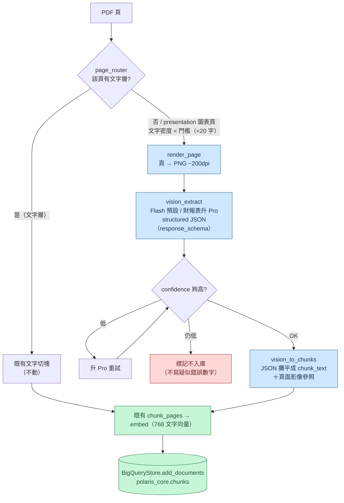
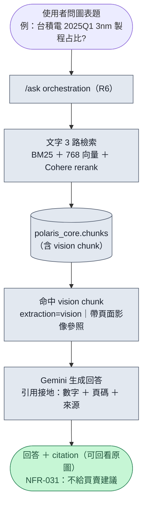

# Vision-OCR-to-text Ingestion 設計（圖表/掃描頁 → 結構化抽取 → 文字 chunk）

- **日期**：2026-06-23
- **狀態**：Proposed — **可行性已實測（2026-06-24 PoC，見下）**；待 Gate1 全面抽取準確率驗證
- **取代**：ColPali 單向量第 4 路（實測 FAIL，見下「背景與決策」）
- **Owner**：R4（ingestion）；驗證 R1 + R5

---

## 背景與決策（為何放棄 ColPali、改走本案）

ColPali 第 4 路（視覺檢索）已實測 **gate ③ FAIL**：

- round-trip 命中率 **hit@5 = 0%**（15 題重建 gold，2026-06-23 在 Colab T4 跑兩次重現）。
- 失敗模式為 **embedding collapse**：任何 query（含「今天台北天氣」等亂問）都回同一批 hub 頁，gold vs 亂問的相似度 separation 僅 ~0.05。
- 根因在**資料層**：`colpali_pages` 把每頁多向量 **mean-pool 成單一 128 維** 再進 BigQuery cosine。實測頁向量本身已退化——跨公司頁 cosine 0.92~0.98、甚至有兩頁完全相同（1.000）。ColPali 是 late-interaction（多向量 MaxSim）模型，被壓成單向量 cosine 即失去鑑別度；query 端兩種 pooling（全 token / 內容 token）都無法挽救。

**決策**：依 TD-01 收掉「單向量 ColPali 第 4 路」，但**不放棄原始目標**（讓系統能回答圖表/掃描頁的問題）。改採本案：在**入庫時**用 vision 把圖表/掃描頁抽成文字，併入既有文字檢索 stack。`polaris_core.colpali_pages` 資料保留（不刪、不用）。

ColPali 原始引入理由（規格）：法說簡報「圖表多文字少」、部分財報頁是 400dpi 掃描圖（0 文字層，如台積電 p3–9 損益表/資產負債表）——一般 `pdftotext`/`pypdf` 抽到 ~0 字，文字 RAG 碰不到。本案正面解這個缺口。

---

## 可行性驗證（2026-06-24 PoC — ColPali 當初少做的一步）

A 唯一沒被現有 stack 驗證過的環節是「Gemini vision 能否準確抽出這些真實台股法說頁的數字」。
其餘（抽出的文字 → 768 文字向量 → 文字 3 路 / `/ask`）都是現役、已驗證能動。故對 vision
抽取做最小實測：抓真 PDF（`fetch-tw-earnings-call` 取 2330 2025Q1 簡報）→ render PNG →
Gemini Flash（Vertex，團隊設定）structured output 抽取 → 比對頁面真值。

| 測試頁 | 類型 | 結果 |
|--------|------|------|
| 製程別 pie（p4，image-only 圖表） | 圓餅圖 | 主要數值 **全對**（3nm 22% / 5nm 36% / 7nm 15% / 16-20nm 7% / 28nm 7% / 65nm 4% / …）；極小切片（40/45nm、90nm）±1%；**沒印數字的長條圖回 `null`（零幻覺）** |
| 2025Q2 業績展望（p8，密集數字） | 數字頁 | 284 億 / 292 億 / 匯率 32.5 / 毛利率 57-59% / 營益率 47-49% **全對**，confidence 1.0 |

**結論**：結構化 vision 抽取在真實頁面上**準確、可驗、且具備正確的不幻覺行為**（無數值處回 null），
與 ColPali 的 0%／不可鑑別形成強烈對比。**A 可行**。殘留風險：①極小切片 ±1%；②密集「掃描」
財報三表（本簡報 p8 是有文字層的展望頁，非掃描表）尚未單獨測——兩者皆由設計內的
**Gate1（≥95% 抽取準確率抽樣）+ 財報表升 Pro** 涵蓋。

## 目標 / 非目標

**目標**
- 讓圖表/掃描頁的內容（含數字）變成可檢索、可引用的文字，進入既有 `chunks` → 文字 3 路 → `/ask`。
- 對「圖表題」（場景 3）能回答並接地到正確頁與數字。

**非目標（YAGNI）**
- 不自建第 4 路 / 視覺索引 / MaxSim。
- 不改 `chunks` schema（結構化 JSON 欄列為未來選項，走 SOP §7 PR，本案不做）。
- 不在 `/ask` workflow 加圖表題路由（vision chunk 進 `chunks` 後既有路徑自動涵蓋）。
- 不刪 `colpali_pages`。

---

## 架構總覽

核心：**把「沒文字層/圖表頁」的問題在入庫時解決**，產物進**現有 `chunks` 表**（768 文字向量），自動沿用已驗證能動的：文字 3 路（BM25+向量+Cohere rerank）、citation、`v_chunk_semantic`、`/ask`。**不新增索引、不用 MaxSim、不接 /ask 路由、不做 Phase 2**（數字在入庫時已成文字）。

```
PDF 頁
 └─ page_router：有文字層? ──是──→ 既有文字切塊（不動）
                     └──否/簡報圖表頁──→ render_page(PNG)
                            └─ vision_extract（Flash 預設 / 財報表升 Pro，structured JSON）
                                   └─ vision_to_chunks（JSON 攤平成 chunk_text）
                                          └─ 既有 chunk_pages → embed → BigQueryStore.add_documents
                                                 └─ chunks 表 → 文字 3 路 / /ask（既有，零改動）
```

## 流程圖

### 1) 資料流（入庫：PDF 頁 → 可檢索文字 chunk）

> 藍色 = 本案新增（`render_page` / `vision_extract` / `vision_to_chunks`）；灰色 = 現役、已驗證能動。**綠色** = 兩條路最終都匯進同一張 `chunks` 表。



### 2) 使用者流（查詢：圖表題 → 接地回答）

> 檢索端**零改動**——vision chunk 進 `chunks` 後，跟一般文字 chunk 走完全相同的既有路徑（R6 `/ask` → 文字 3 路 → 生成）。差別只在命中的若是 vision chunk，citation 會帶**頁面影像參照**可回看原圖。



## 元件（皆掛在 `src/polaris/ingestion/`）

1. **`page_router`**：逐頁分流。有文字層 → 既有文字路；`doc_type=presentation` **或** 文字密度低於門檻（如該頁 `pypdf` 抽出 < 20 個非空白字元，視為掃描/圖表頁）→ vision 路。文字頁與 vision 頁可並存於同一份 PDF。
2. **`render_page`**：PDF 頁 → PNG（pymupdf 或 pdftoppm，~200dpi）。
3. **`vision_extract.py`（新）**：階梯模型——Flash 預設；`doc_type=financial_statement` 或 Flash 回低信心/空 → 升 Pro。用 Gemini **structured output（response_schema）** 回經 pydantic 驗證的 JSON：
   `page_summary / chart_type / series[] / table_markdown / key_values[{label,value,unit}] / confidence`。
   嚴格 prompt：**只轉錄頁面看得到的文字/數字；看不清填 null；不推論、不計算。**
4. **`vision_to_chunks`**：把 JSON **攤平成可讀 `chunk_text`**（page_summary + key_values 條列 + table_markdown），交既有 `chunk_pages` → embed。chunk id 沿用確定性命名 `{ticker}-{period}-p{page:03d}-c{seq:03d}`。

## 資料流與儲存

- 寫入走既有 **`BigQueryStore.add_documents`**（R4 有 polaris_core WRITE）。
- **儲存決策：攤平進 `chunk_text`，不改 schema**（零 SOP §7 PR、立即可用）。
- metadata：`doc_type` 沿用（`presentation` / `financial_statement`），加 `extraction="vision"` 標記 + 頁面影像參照（`source_file` + `page_num`）作為 citation 來源。

## 防幻覺 / 接地（對齊憲法「每個數字要有來源」）

- structured output + 嚴格轉錄 prompt（轉錄 only、null、不推論）。
- `confidence` 低 → 升 Pro 重試；仍低 → **標記不入庫**（不寫疑似錯誤數字）。
- 每個 vision chunk **必帶頁面影像參照**當引用來源（可回看原圖）。
- 輕量 sanity check（可選）：pie 類 `key_values` 百分比加總 ~100%，異常標記。

## 驗證（三階閘，過了才信任進 prod）

- **Gate1 抽取準確率**（Owner R1）：抽樣（建議 20–30 頁、≥4 公司、涵蓋 pie/trend/財報表）人工比對 JSON vs 真實圖表，**數字準確率 ≥ 95%** 才放行。
- **Gate2 端到端**（Owner R5）：對圖表題集跑既有 Ragas eval，看 `/ask` 是否引用正確數字。
- 兩關皆過 → 正式信任 vision chunk。

## 角色分工（誰做什麼）

> 原則：**code 可由 R2 agent 代工，但「寫進 canonical 庫」與「品質放行」兩個權力點不在 agent 手上**——分別交付給 R4（憲法 III：唯一可寫 `polaris_core`）與 R1（Gate1 放行）。

| 角色 | 這個 A 案要做的事 | 交付物 / 關卡 |
|------|------------------|---------------|
| **R2 agent**（本案代工者） | 代寫全部 ingestion code（8 個 TDD task，`src/polaris/ingestion/`）；跑 pilot（2330+2891）**到 dev dataset**。**不可寫 `polaris_core`**（waynehuichi 帳號）。 | code merged；`data/vision_chunks/*.jsonl` + `*_gate1.csv` |
| **R4**（程式 owner / ingestion） | 收 code 驗收；**用 R4 帳號**（或 R4 GCE SA + `BQ_ALLOW_CORE_WRITE=1`）把 JSONL 載入 `polaris_core`；確認 `doc_type=financial_statement` 來源（無則用「Flash 低信心」當升 Pro 訊號）。 | core ingestion 完成 |
| **R1**（驗證） | **Gate1 主驗**：抽 20–30 頁、≥4 公司、涵蓋 pie/trend/財報表，人工比對 JSON vs 真圖，**數字準確率 ≥ 95%** 才放行。 | Gate1 sign-off |
| **R5**（eval） | **Gate2 端到端**：對圖表題集跑既有 Ragas，看 `/ask` 是否引用正確數字。 | Gate2 sign-off |
| **R3**（檢索） | **待命，無 code**——A 案刻意不動檢索端（不新增第 4 路 / 不改 `/ask` 路由）。 | — |

## 上線範圍 / Owner / 冪等

- **程式 owner R4；本案由 R2 agent 代寫**；純 Gemini API，**不需 GPU**。
- **Rollout：先 pilot 台積電(2330)+中信金(2891)** 跑通 → 過 Gate1 → 再放大到 20 檔 canonical 的 presentation + 掃描財報頁。
- chunk id 確定性 → **可重跑 upsert**。

## 測試 / CI

- vision client 走**注入式 seam**（同既有 BigQuery / LLM 套路）：CI 注入 fake → **0 外呼、0 金鑰**；真抽取為離線一次性，不進 CI 熱路徑。
- 純函式單元測試：`page_router` 分流判斷、`vision_to_chunks` 攤平、sanity check、pydantic schema 驗證。

## 風險 / 待解

- **抽取幻覺**：靠 Gate1（≥95%）+ confidence 升級 + 不入庫 + 影像參照接地控制。
- **成本**：階梯模型（Flash 為主）+ pilot 先行控制；放大前估算全量 token。
- **渲染相依**：pymupdf/pdftoppm 擇一，加進 ingestion optional 相依。
- **doc_type=financial_statement 來源**：需確認 ingestion 是否已能標出財報表頁以觸發升 Pro；若無，先用「Flash 低信心」作為升級訊號。

---

## 附錄：「真 ColPali」可行性研究（2026-06-24）

> 群組提問：**能不能做出跟 ColPali 一樣的功能來滿足這個專案及第 4 路？** 本附錄是研究結論，供決策參考；**不改變本案（Approach A 仍為主路）**。

### A. 釐清：repo 現有的「ColPali」不是 ColPali

讀 [`colpali_store.py`](../../../src/polaris/vectorstore/colpali_store.py)、[`colpali_query_encoder.py`](../../../src/polaris/retrieval/colpali_query_encoder.py) 與 [2026-06-20 restore-4th-path 設計](2026-06-20-restore-4th-retrieval-path-vision-design.md) 後確認：

| 真 ColPali（late-interaction） | 本專案實際做的 |
|---|---|
| 每頁 ~1031 個 patch 各一個 128 維向量（**多向量**） | 1031 patch **mean-pool 成單一 128 維** |
| query 每個 token 也是多向量 | query token 也 mean-pool 成單一向量 |
| **MaxSim late-interaction** 計分（精髓） | BigQuery `VECTOR_SEARCH` **單向量 cosine** |
| patch 矩陣保留 | **入庫時就丟棄 patch 矩陣** |

2026-06-20 設計 §2 非目標明寫「**不重建 patch 級多向量 / MaxSim**（資料端只存了池化 128 維，沿用之）」。故 hit@5 = 0% **不是 bug，是把多向量壓成單一平均的必然**（所有 query 塌到同方向）。query 端 `content_only` 修補（丟 scaffold token）只是減輕塌縮，**單向量 × 單向量永遠拿不回 late-interaction**。

### B. 不可逆性（關鍵）

`polaris_core.colpali_pages`（5701 頁）存的是**池化後 128 維**，patch 矩陣已不存在。要做真 ColPali，**這 5701 頁必須由 R4 用 GPU 全部重編一次**，無法從現有資料救回。

### C. 真 ColPali 的成本與憲法落差

| 需求 | 與現況落差 |
|---|---|
| 多向量編碼器（ColPali/ColQwen2，GPU 常駐） | 憲法技術棧為 `gemini-embedding-2`（768/單向量）；ColPali 是不同空間，**不在 sanctioned stack** |
| 支援 MaxSim 的向量庫（Vespa / Qdrant 1.10+ / LanceDB） | 預設 `VECTOR_BACKEND=bigquery`，**BigQuery 只有單向量 ANN，不做 MaxSim**；pgvector 亦不支援 → 須架第三個 backend |
| 重編 5701 頁（保留 patch 矩陣） | R4 GPU 批次，~1.5GB（bf16） |
| 查詢端 GPU 常駐做 query 多向量編碼 | 新增 serving 相依（冷啟動或常開 GPU） |

### D. 致命點：ColPali 解「找到頁」，不解「引用接地」

憲法硬約束為**每個數字都要有來源**。ColPali 只回「答案在第 N 頁圖」，**不抽出圖中數字**；仍須 render 該頁 → vision LLM 讀數字才能接地——而這**正是 Approach A 在入庫時就完成的事**。

> **結論**：真 ColPali 即使做出來，**底下仍須疊一層 vision 抽取才能接地**。Approach A 不是 ColPali 的替代品，而是它的**必要底座**。

### E. 三條路對比

| | A. Vision-OCR→文字（本案） | B. 真 ColPali（多向量+MaxSim） | C. 混合 |
|---|---|---|---|
| 檢索 | 重用既有文字 3 路（已證） | 新 MaxSim 路（視覺召回最強） | A 接地 + B 當召回 booster |
| 接地 | ✅ 入庫即抽成文字，天然接地 | ❌ 仍須疊 vision 抽取 | ✅ |
| 合憲法技術棧 | ✅ gemini + bigquery | ❌ 需 GPU 模型 + 新向量庫 | ❌ |
| 新基建 | 0（無新庫、無新路由） | GPU serving + Qdrant/Vespa + 重 ingest | 全部 |
| 狀態 | PoC 已證可行（2026-06-24） | 池化版未過 70%；多向量版未驗 | — |

### F. 建議

**第 4 路真正要的「圖表題能答且能接地」，Approach A 比搶救 ColPali 更直接、更合憲法、且已 PoC 證明。** 真 ColPali 僅在**「A 上線後圖表題召回率被證明不足」**時，才作為召回增強器加入，且仍須餵 vision 抽取的 chunk 去接地。

在那之前，若要驗證真 ColPali 是否值得，**最低成本的下一步是『量』而非『建』**：R4 用 GPU 重編「幾百頁」保留 patch 矩陣 → 用 numpy / BigQuery SQL 直接算 MaxSim（**不必先架 Qdrant/Vespa**）→ 跑 hit@5 與 A 的召回對比。**未顯著勝出即不投基建。** 此實驗需逆轉 TD-01（記為 TD-02）並經 PM 簽核。
