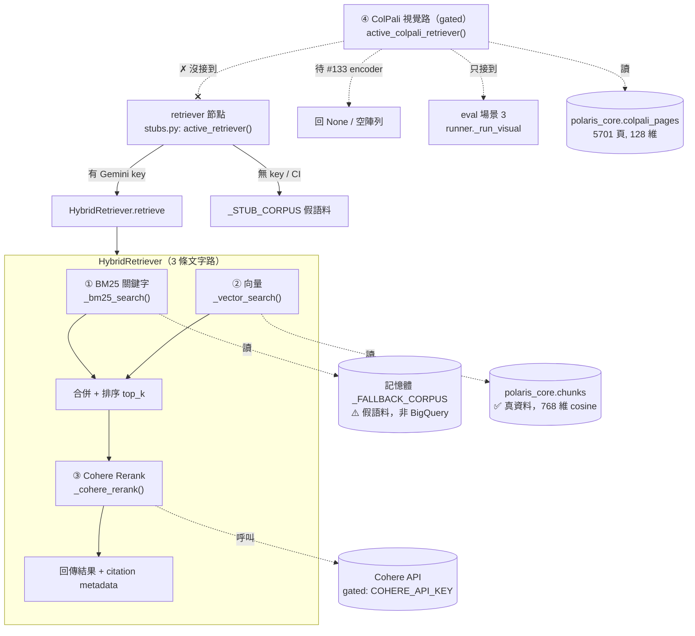
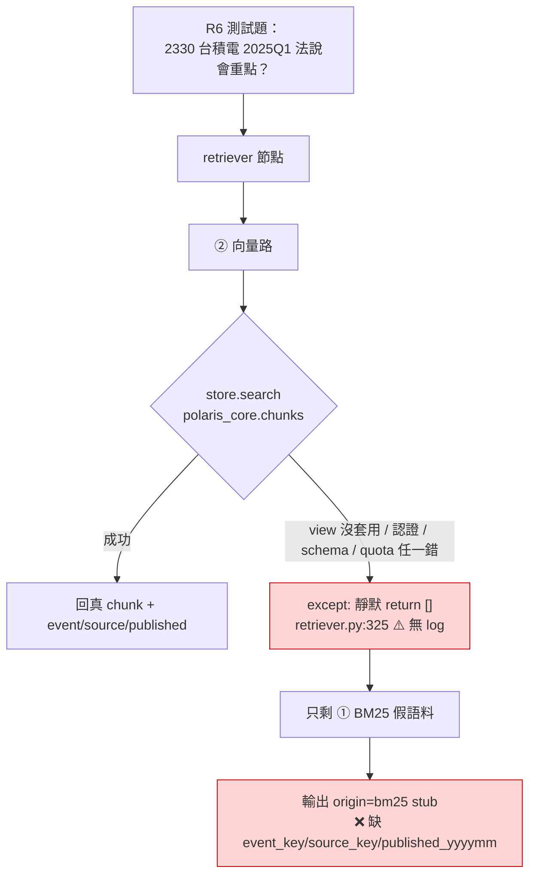

# 架構圖：檢索路徑與 `/ask` 流程

> 對象：全隊（R2/R3/R4/R6/R7）。目的：把「`/ask` 到底走哪條路、碰不碰得到真資料」一次講清楚，
> 對齊 R6 在 #132 後的三個觀察。
> 維護者：R2（施惠棋）。最後校對：2026-06-21，對齊 `main` 上 `src/polaris/retrieval/retriever.py`。
> **這份是診斷現況快照，不是規格**；規格以 `.specify/memory/constitution.md` 與 spec-kit 為準。

---

## 0. 一句話總結

- **`/ask` 是 HTTP 端點，不是「一條路」**。它把整個問題丟給一個 5-node LangGraph workflow。
- 真正做檢索的是 **`HybridRetriever`**，它有 **3 條「文字」通道**（BM25 / 向量 / Cohere Rerank）。
- **ColPali 是 gated 的第 4 條「視覺」通道**，目前**只接到 eval 場景 3，沒接 `/ask`**，且因為 query 編碼器（#133）還沒做，呼叫等於 no-op。
- ⚠️ **現況**：3 條文字通道裡，只有「向量」通道會碰到 `polaris_core` 真資料；BM25 只查記憶體假語料；
  而向量通道一旦出錯會**靜默吞掉**（`retriever.py:325`），於是退回 BM25 → 產出 `bm25` stub 引用、沒有 `event_key/source_key/published_yyyymm`。**這就是 R6 測試題的根因。**

---

## 1. `/ask` 端點 → 5-node Workflow

```mermaid
flowchart LR
    U[使用者 / 前端] -->|POST /ask| API["api.py<br/>ask()"]
    API -->|build_workflow().invoke| P
    subgraph WF["LangGraph Workflow"]
        direction LR
        P[Planner] --> R[Retriever] --> C[Calculator] --> W[Writer] --> CP[Compliance]
    end
    R -.->|這裡才做真正檢索| HYB[(HybridRetriever)]
    CP --> OUT[回傳答案 + 引用]
```

- `/ask` 進入點：[api.py:138](../src/polaris/api.py#L138) → `build_workflow().invoke(...)`
- 節點註冊：`graph/workflow.py`，順序 **Planner → Retriever → Calculator → Writer → Compliance**
- 只有 **Retriever** 這個節點會去叫 `HybridRetriever`（見下節）。其餘節點不碰向量庫。

---

## 2. Retriever 節點內部：3 條文字路 + 1 條 gated 視覺路



### 三條文字路的真相（按通道）

| # | 通道 | 程式碼 | 資料來源 | 狀態 |
|---|------|--------|----------|------|
| ① | BM25 關鍵字 | [`retriever.py:290`](../src/polaris/retrieval/retriever.py#L290) | **記憶體 `_FALLBACK_CORPUS`（假語料）** | ⚠️ **不碰真 BigQuery**；只當保底，命中就回 `origin="bm25"` |
| ② | 向量 | [`retriever.py:317`](../src/polaris/retrieval/retriever.py#L317) | `polaris_core.chunks`（透過 `BigQueryStore`） | ✅ **唯一碰真資料的路**；但出錯會靜默吞（見 §3） |
| ③ | Cohere Rerank | [`retriever.py:347`](../src/polaris/retrieval/retriever.py#L347) | Cohere API | gated：有 `COHERE_API_KEY` 才開；失敗**會** `logger.warning` |

### 第 4 路（ColPali 視覺）的真相

| 項目 | 現況 |
|------|------|
| 接到 `/ask`？ | ❌ **沒有**。`active_retriever()` 永遠只回 `HybridRetriever`，不含 ColPali |
| 接到哪？ | 只接 **eval 場景 3**（[`runner._run_visual`](../src/polaris/eval/runner.py)）。沒 encoder 時直接 `raise NotImplementedError` 指向 #133 |
| 能跑嗎？ | ❌ no-op。`active_colpali_query_fn()` 永遠回 `None`（[`colpali_retriever.py:39`](../src/polaris/retrieval/colpali_retriever.py#L39)），retriever 立即回 `[]` |
| 卡在哪？ | **issue #133**：R4 尚未提供 query 端編碼器（同模型、同 patch 池化、128 維）。**注意 #133 目前只是 commit 訊息裡的佔位號，不是真的 PR** |
| 資料在嗎？ | ✅ 在。`polaris_core.colpali_pages` 已有 5701 頁（20 檔，128 維）。**資料層沒被砍，是 R3 整合層沒接** |

---

## 3. R6 三個觀察的共同根因



三個觀察其實是同一條因果鏈：

1. **#132 已 merge，但 `v_colpali_pages_semantic` 查不到** → migration **程式碼進 main ≠ 套用到線上 `polaris_core`**。view 沒在線上建起來。
2. **`/ask` 仍走 `chunks`/`BigQueryStore`** → 事實如此：`BigQueryStore._table` **硬編碼 `.chunks`**（[`bigquery_store.py:48`](../src/polaris/vectorstore/bigquery_store.py#L48)），**沒有 env 開關**能切到 semantic view，要切必須改 R3 的程式碼。
3. **測試題回 `bm25` stub、缺三個欄位** → 因為向量路（唯一帶得出那些欄位的路）出錯被 §3 那個 `except` 靜默吞掉，只剩 BM25 假語料保底。

> 🔑 **`retriever.py:325` 的靜默吞錯**是 R3 在 #49（D3 階段，2026-06-07）寫的。
> 當時向量後端確實「可有可無」，靜默退回 BM25 是合理保底；
> 但後來向量路變成唯一碰真資料的主力，這段卻沒回頭補 log，於是**藏住了線上故障**。
> 同一支檔案的 Cohere rerank 路有補 `logger.warning`，向量路沒有 → 對比明顯。

---

## 4. 修復順序（建議，待團隊確認）

| 優先 | 動作 | Owner | 說明 |
|------|------|-------|------|
| P0 | `_vector_search` 的 `except` 加 `logger.warning(..., exc_info=True)` | R3（或 R2 代改） | 一行純診斷，立刻看得到向量路為何回空 |
| P0 | 確認 #132 / #120 的 view migration **真的套用到線上 `polaris_core`** | R2 / R4 | 程式碼 merge 不等於線上建好 view |
| P1 | `BigQueryStore` 從 `.chunks` 切到 `v_chunk_semantic`，並把 `event_key/source_key/published_yyyymm` 帶進 citation | R3 | 真正解 R6 三觀察的主修；需改碼（無 env 開關） |
| P1 | 切完後重新部署 Cloud Run + 跑 R6 測試題 smoke | R2 | 驗證端到端 |
| P2 | ColPali 第 4 路啟用：先補 #133 encoder + PM sign-off（TD-02）+ ≥70% round-trip 閘 | R4 + R2(PM) | 視覺路與文字路分開，不混排序 |

---

## 5. 檔案對照（點擊可開）

| 角色 | 檔案:行 |
|------|---------|
| `/ask` 端點 | [api.py:138](../src/polaris/api.py#L138) |
| Workflow 5-node | [graph/workflow.py](../src/polaris/graph/workflow.py) |
| retriever 節點（選真/stub） | [graph/nodes/stubs.py](../src/polaris/graph/nodes/stubs.py) |
| HybridRetriever 三路 | [retrieval/retriever.py:329](../src/polaris/retrieval/retriever.py#L329) |
| ① BM25（假語料） | [retrieval/retriever.py:290](../src/polaris/retrieval/retriever.py#L290) |
| ② 向量 + 靜默吞錯 | [retrieval/retriever.py:317](../src/polaris/retrieval/retriever.py#L317) |
| BigQueryStore（硬編碼 `.chunks`） | [vectorstore/bigquery_store.py:48](../src/polaris/vectorstore/bigquery_store.py#L48) |
| ④ ColPali retriever（gated） | [retrieval/colpali_retriever.py](../src/polaris/retrieval/colpali_retriever.py) |
| ColPali store（colpali_pages） | [vectorstore/colpali_store.py](../src/polaris/vectorstore/colpali_store.py) |
| ColPali 唯一消費者（eval） | [eval/runner.py](../src/polaris/eval/runner.py) |
| ColPali Phase 1 計畫 | [docs/superpowers/plans/2026-06-20-colpali-4th-path-phase1.md](./superpowers/plans/2026-06-20-colpali-4th-path-phase1.md) |
