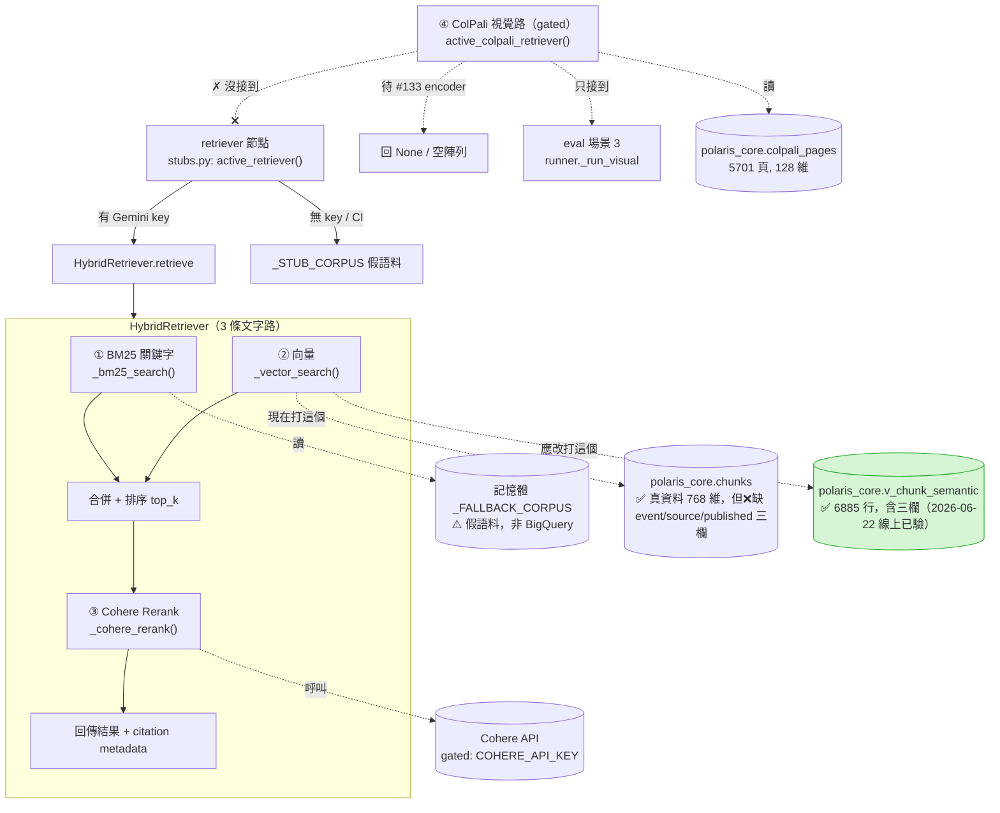
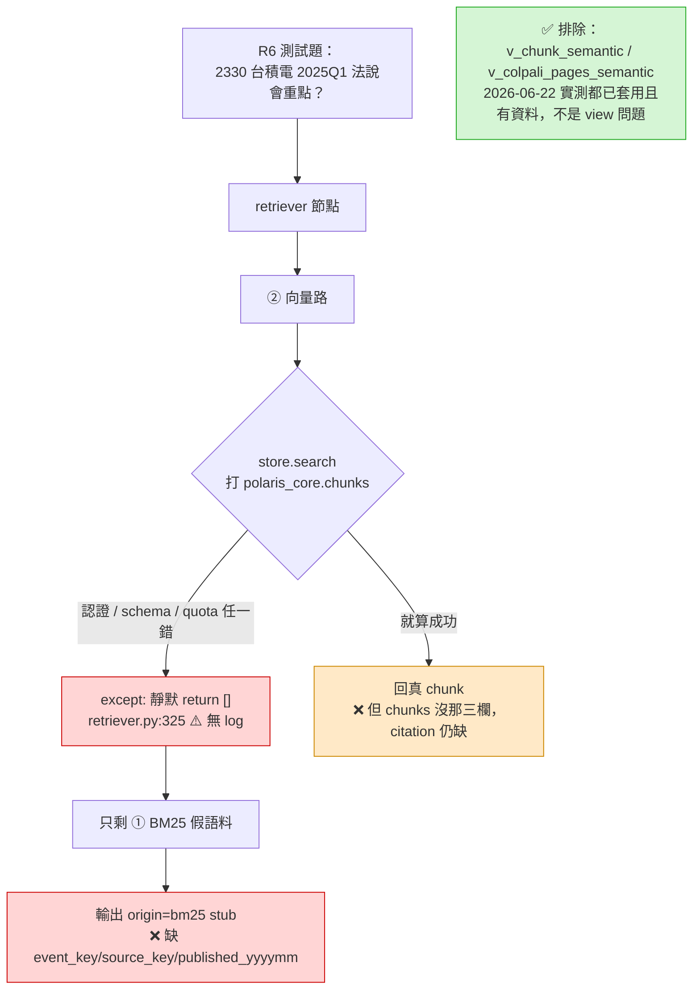

# 架構圖：檢索路徑與 `/ask` 流程

> 對象：全隊（R2/R3/R4/R6/R7）。目的：把「`/ask` 到底走哪條路、碰不碰得到真資料」一次講清楚，
> 對齊 R6 在 #132 後的三個觀察。
> 維護者：R2（施惠棋）。最後校對：**2026-06-22**，對齊 `main` 上 `src/polaris/retrieval/retriever.py` + 線上 `polaris_core` 實測。
> **這份是診斷現況快照，不是規格**；規格以 `.specify/memory/constitution.md` 與 spec-kit 為準。

> 🔬 **2026-06-22 線上 `polaris-desk-team.polaris_core` 實測**：兩個 semantic view **都已套用、都有資料**
> （`v_chunk_semantic` 6885 行、`v_colpali_pages_semantic` 5701 行）。先前「view 沒套用到線上」的推測**已作廢**。
> 真因收斂成兩條、**都跟 view 無關**：① 向量路打的 base table `chunks` **本身就沒有** `event_key/source_key/published_yyyymm` 三欄（`v_chunk_semantic` 才有）；② 向量路出錯被 `retriever.py:325` 靜默吞掉。詳見 §3。

---

## 0. 一句話總結

- **`/ask` 是 HTTP 端點，不是「一條路」**。它把整個問題丟給一個 5-node LangGraph workflow。
- 真正做檢索的是 **`HybridRetriever`**，它有 **3 條「文字」通道**（BM25 / 向量 / Cohere Rerank）。
- **ColPali 是 gated 的第 4 條「視覺」通道**，目前**只接到 eval 場景 3，沒接 `/ask`**。query 編碼器（#133）已併入但預設 **gated-off**（`COLPALI_QUERY_ENCODER`），故呼叫仍等於 no-op；驗證（≥70% round-trip）尚未實測、延後處理。
- ⚠️ **現況（兩個獨立缺陷）**：3 條文字通道裡，只有「向量」通道會碰到 `polaris_core` 真資料；BM25 只查記憶體假語料。
  1. 向量路打的 base table 是 `chunks`，而 `chunks` **本身就沒有** `event_key/source_key/published_yyyymm`——所以就算向量路成功，citation 也帶不出那三欄（要改打 `v_chunk_semantic`）。
  2. 向量路一旦出錯會**靜默吞掉**（`retriever.py:325`），於是退回 BM25 → 產出 `bm25` stub 引用。**R6 測試題拿到 `bm25` stub 正是這條觸發的。**

---

## 1. `/ask` 端點 → 5-node Workflow

```mermaid
flowchart LR
    U[使用者 / 前端] -->|POST /ask| API["api.py<br/>ask()"]
    API -->|build_workflow().invoke| P
    subgraph WF["LangGraph Workflow"]
        direction LR
        P[Planner] --> R[Retriever] --> C[Calculator] --> W[Writer] --> CP[Compliance]
    end
    R -.->|這裡才做真正檢索| HYB[(HybridRetriever)]
    CP --> OUT[回傳答案 + 引用]
```

- `/ask` 進入點：[api.py:138](../src/polaris/api.py#L138) → `build_workflow().invoke(...)`
- 節點註冊：`graph/workflow.py`，順序 **Planner → Retriever → Calculator → Writer → Compliance**
- 只有 **Retriever** 這個節點會去叫 `HybridRetriever`（見下節）。其餘節點不碰向量庫。

---

## 2. Retriever 節點內部：3 條文字路 + 1 條 gated 視覺路



### 三條文字路的真相（按通道）

| # | 通道 | 程式碼 | 資料來源 | 狀態 |
|---|------|--------|----------|------|
| ① | BM25 關鍵字 | [`retriever.py:290`](../src/polaris/retrieval/retriever.py#L290) | **記憶體 `_FALLBACK_CORPUS`（假語料）** | ⚠️ **不碰真 BigQuery**；只當保底，命中就回 `origin="bm25"` |
| ② | 向量 | [`retriever.py:317`](../src/polaris/retrieval/retriever.py#L317) | `polaris_core.chunks`（透過 `BigQueryStore`，硬編碼） | ✅ **唯一碰真資料的路**；但兩個問題：base table `chunks` 缺三欄（要改打 `v_chunk_semantic`）、且出錯會靜默吞（見 §3） |
| ③ | Cohere Rerank | [`retriever.py:347`](../src/polaris/retrieval/retriever.py#L347) | Cohere API | gated：有 `COHERE_API_KEY` 才開；失敗**會** `logger.warning` |

### 第 4 路（ColPali 視覺）— ❌ FAIL，已收掉（2026-06-24）

> **決策**：ColPali gate ③ 於 2026-06-23 實測 **FAIL**（hit@5=0%，embedding collapse）。單向量 ColPali 第 4 路正式收掉（issue #17 關閉）。
> **新方向**：vision-OCR-to-text ingestion，法說簡報圖表頁 → Gemini structured extraction → `chunks` 表（`doc_type=presentation`）→ 現有文字 3 路自動涵蓋。
> 詳見：`docs/superpowers/specs/2026-06-23-vision-ocr-to-text-ingestion-design.md`

| 項目 | 現況 |
|------|------|
| gate ③ 結果 | ❌ **FAIL**。hit@5=0%（15 題），embedding collapse：頁向量跨公司 cosine 0.92–0.98，mean-pool 單向量喪失鑑別度 |
| `colpali_pages` 資料 | 保留不刪，但**不再使用**（`/library` 不查此表，retriever 不走視覺路） |
| 取代方案 | vision-OCR-to-text（R4 owner），PoC 已驗（2026-06-24：圓餅圖/數字頁準確率 ~100%，0 幻覺）|

---

## 3. R6 三個觀察的共同根因



R6 三個觀察重新校準後（2026-06-22 線上實測）：

1. ~~**#132 已 merge 但 `v_colpali_pages_semantic` 查不到 → view 沒套用到線上**~~ → **已作廢**。線上實測兩個 view 都在、都有資料（`v_chunk_semantic` 6885、`v_colpali_pages_semantic` 5701）。R6 當初查不到，應是在 `v_colpali_pages_semantic` 建立（2026-06-21 12:15）之前看的。
2. **`/ask` 仍走 `chunks`/`BigQueryStore`** → 事實如此：`BigQueryStore._table` **硬編碼 `.chunks`**（[`bigquery_store.py:49`](../src/polaris/vectorstore/bigquery_store.py#L49)），**沒有 env 開關**能切到 semantic view，要切必須改 R3 的程式碼。**而 `chunks` 本身就沒有那三個 citation 欄位**（線上 `INFORMATION_SCHEMA` 確認：`chunks` 三欄全無、`v_chunk_semantic` 三欄齊全）——這才是「就算向量路成功、citation 也帶不出三欄」的主因。
3. **測試題回 `bm25` stub、缺三個欄位** → 向量路（唯一可能帶出那些欄位的路）出錯被 §3 那個 `except` 靜默吞掉，只剩 BM25 假語料保底，於是 origin 變 `bm25`。**沒有 log 就無法判斷向量路是「打 chunks 失敗」還是「embedding 沒生出來」**——這正是 P0 補 log 的價值。

> 🔑 **`retriever.py:325` 的靜默吞錯**是 R3 在 #49（D3 階段，2026-06-07）寫的。
> 當時向量後端確實「可有可無」，靜默退回 BM25 是合理保底；
> 但後來向量路變成唯一碰真資料的主力，這段卻沒回頭補 log，於是**藏住了線上故障**。
> 同一支檔案的 Cohere rerank 路有補 `logger.warning`，向量路沒有 → 對比明顯。

---

## 4. 修復順序（建議，待團隊確認）

| 優先 | 動作 | Owner | 狀態 / 說明 |
|------|------|-------|------|
| ✅ done | 確認 #132 / #120 的 view migration **真的套用到線上 `polaris_core`** | R2 | **2026-06-22 已驗**：`v_chunk_semantic`(6885)、`v_colpali_pages_semantic`(5701) 都在、都有資料、且含三欄 |
| P0 | `_vector_search` 的 `except` 加 `logger.warning(..., exc_info=True)` | R3 | 一行純診斷，立刻看得到向量路為何回空（打 chunks 失敗？embedding 沒生出來？） |
| P1 | `BigQueryStore` 從 `.chunks` 切到 `v_chunk_semantic`，並把 `event_key/source_key/published_yyyymm` 帶進 citation | R3 | **真正解 R6 的主修**；`chunks` 本身無三欄，view 才有。需改碼（無 env 開關），view 端已 ready |
| P1 | 切完後重新部署 Cloud Run + 跑 R6 測試題 smoke | R2 | 驗證端到端 |
| ~~P2~~ | ~~ColPali 第 4 路啟用~~ | ~~R4~~ | ❌ gate ③ FAIL，收掉。改走 vision-OCR-to-text（見 §2.3）|
| P2 | vision-OCR-to-text ingestion（法說簡報/掃描財報頁 → `chunks` `doc_type=presentation`）| R4 | ⏳ PoC 完成（2026-06-24），Gate1 抽取準確率驗證中 |

**依賴順序**：① 先（最便宜的 go/no-go）→ 過了才值得做 ②③（把檢索接上 `/ask`，此時使用者可被導到「正確的那一頁」）→ ④ 才能真正「回答圖裡的數字」。
**只做 ①②③**：使用者問圖表題會拿到「答案在 ⃝⃝ 法說第 9 頁」這種頁碼指引（可點開看圖），但系統**不會幫你把數字讀出來**——那是 ④ 的事。

---

## 5. 檔案對照（點擊可開）

| 角色 | 檔案:行 |
|------|---------|
| `/ask` 端點 | [api.py:138](../src/polaris/api.py#L138) |
| Workflow 5-node | [graph/workflow.py](../src/polaris/graph/workflow.py) |
| retriever 節點（選真/stub） | [graph/nodes/stubs.py](../src/polaris/graph/nodes/stubs.py) |
| HybridRetriever 三路 | [retrieval/retriever.py:329](../src/polaris/retrieval/retriever.py#L329) |
| ① BM25（假語料） | [retrieval/retriever.py:290](../src/polaris/retrieval/retriever.py#L290) |
| ② 向量 + 靜默吞錯 | [retrieval/retriever.py:317](../src/polaris/retrieval/retriever.py#L317) |
| BigQueryStore（硬編碼 `.chunks`） | [vectorstore/bigquery_store.py:49](../src/polaris/vectorstore/bigquery_store.py#L49) |
| `v_chunk_semantic`（含三欄，建議改打） | `polaris_core.v_chunk_semantic`（#120，線上已套用） |
| ④ ColPali retriever（gated） | [retrieval/colpali_retriever.py](../src/polaris/retrieval/colpali_retriever.py) |
| ColPali store（colpali_pages） | [vectorstore/colpali_store.py](../src/polaris/vectorstore/colpali_store.py) |
| ColPali 唯一消費者（eval） | [eval/runner.py](../src/polaris/eval/runner.py) |
| ColPali Phase 1 計畫 | [docs/superpowers/plans/2026-06-20-colpali-4th-path-phase1.md](./superpowers/plans/2026-06-20-colpali-4th-path-phase1.md) |
